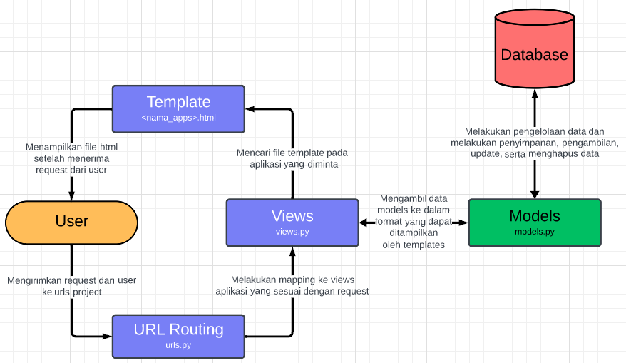

# Concert Ticket Inventory Guide
**Nama  : Kelvin Saputra**

**NPM   : 2206027186**

**Kelas : PBP F**

**Link  : [Concert Ticket Inventory](https://kelvin-saputra-tugas.pbp.cs.ui.ac.id)**

## To Do List TUGAS 2
- [x] Membuat sebuah proyek Django baru.
- [x] Membuat aplikasi dengan nama main pada proyek tersebut.
- [x] Melakukan routing pada proyek agar dapat menjalankan aplikasi main.
- [x] Membuat model pada aplikasi main dengan nama Item dan memiliki atribut wajib sebagai berikut.
    * name sebagai nama item dengan tipe CharField.
    * amount sebagai jumlah item dengan tipe IntegerField.
    * description sebagai deskripsi item dengan tipe TextField.

- [x] Membuat sebuah fungsi pada views.py untuk dikembalikan ke dalam sebuah template HTML yang menampilkan nama aplikasi serta nama dan kelas kamu.
- [x] Membuat sebuah routing pada urls.py aplikasi main untuk memetakan fungsi yang telah dibuat pada views.py
- [x] Melakukan deployment ke Adaptable terhadap aplikasi yang sudah dibuat sehingga nantinya dapat diakses oleh teman-temanmu melalui Internet.
- [x] Membuat sebuah README.md yang berisi tautan menuju aplikasi Adaptable yang sudah di-deploy, serta jawaban dari beberapa pertanyaan berikut.
     * Jelaskan bagaimana cara kamu mengimplementasikan checklist di atas secara step-by-step (bukan hanya sekadar mengikuti tutorial).
     * Buatlah bagan yang berisi request client ke web aplikasi berbasis Django beserta responnya dan jelaskan pada bagan tersebut kaitan antara urls.py, views.py, models.py, dan berkas html.
     * Jelaskan mengapa kita menggunakan virtual environment? Apakah kita tetap dapat membuat aplikasi web berbasis Django tanpa menggunakan virtual environment?
     * Jelaskan apakah itu MVC, MVT, MVVM dan perbedaan dari ketiganya.

### Membuat Project Django
#### Konfigurasi Repositori lokal 
1. Buatlah direktori untuk proyek concert_ticket_inventory.
2. Bukalah terminal lalu Pada terminal, masuk ke dalam folder yang telah dibuat menggunakan perintah <code>cd <nama_directory></code> (change directory). dalam kasus ini direktori saya adalah `concert_ticket_inventory`
3. Selanjutnya buatlah repositori git kosong pada direktori yang digunakan sebagai proyek dengan menuliskan <code>git init</code>.
4. Lakukan konfigurasi *username* dan *email* agar terhubung dengan commit yang dilakukan.

#### Membuat Project Django baru
1. Pada direktori lokal yang dibuat sebelumnya, saya membuat virtual environment dengan menggunakan terminal lalu menuliskan <code>python -m venv env</code> yang bertujuan agar tools yang digunakan pada project ini terisolasi. Sehingga ketika kita melakukan perubahan versi pada tools sewaktu-waktu, project tidak akan mengalami masalah. 
2. Dengan menggunakan terminal, masuk ke dalam virtual environment dengan menggunakan perintah <code>env\Scripts\activate.bat</code> pada windows.
3. Buatlah file `requirements.txt` yang berisikan tools yang akan digunakan dalam project ini termasuk django.
4. Lakukan instalasi pada seluruh library yang terdaftar dalam `requirements.txt` dengan menggunakan perintah <code>pip install -r requirements.txt</code>
5. Setelah django berhasil terinstall, buatlah project baru yang diinginkan dengan menggunakan perintah <code>django-admin startproject <nama_project> .</code> dalam kasus ini nama project saya adalah `concert_ticket_inventory`. tanda titik pada perintah tersebut bertujuan agar project dibuat tanpa membuat direktori baru.
6. Setelah proyek terbentuk, ubah perizinan yang ada pada <code>settings.py</code> dengan menambahkan syntax 
```python
...
ALLOWED_HOSTS = ["*"]
...
```
hal ini memungkinkan project yang kita buat dapat diakses oleh banyak device atau IP.

7. Setelah itu, saya mencoba menjalankan project django pada localhost dengan menggunakan perintah <code>python manage.py runserver</code> selanjutnya buka link berikut http://localhost:8000 jika sudah terlihat animasi roket, maka project dapat berjalan.
8. Selanjutnya buatlah file dengan nama `.gitignore` yang bertujuan agar file-file yang terdaftar pada `.gitignore` tidak ikut di push ke repositori github.

#### Membuat aplikasi dengan nama `main` pada proyek tersebut.
1. Setelah selesai membuat project, masuk ke dalam virtual environment kembali, lalu buatlah app dengan nama `main` dengan menggunakan perintah <code>python manage.py startapp main</code>

#### Melakukan routing pada proyek agar dapat menjalankan aplikasi `main`
1. Setelah membuat aplikasi `main`, agar dapat dijalankan pada level project, perlu dilakukan routing dengan menambahkan aplikasi `main` pada `INSTALLED_APPS` yang berada pada file `settings.py`.
2. Buatlah direktori `Templates` pad direktori `main` yang bertujuan untuk menampung file-file `HTML`.

#### Membuat model pada aplikasi `main` dengan nama Item dan memiliki atribut wajib sebagai berikut.
1. Pada direktori aplikasi `main`, buatlah model `Item` pada `models.py` yang ada pada direktori `main`, lalu selanjutnya menambahkan atribut berupa 
    * `name` dengan tipe `CharField`
    * `amount` dengan tipe `IntegerField`
    * `description` dengan tipe `TextField`
2. Lakukan migrasi tiap kali ada perubahan pada model basis data tersebut

#### Membuat sebuah fungsi pada `views.py` untuk dikembalikan ke dalam sebuah template HTML yang menampilkan nama aplikasi serta nama dan kelas kamu.
1. Untuk membuat fungsi pada `views.py` saya memanfaatkan fungsi `render` yang berasal dari fungsi `django.shortcut`.
2. Buat suatu fungsi bernama `show_main` dengan parameter berupa `requests`.
3. Isi fungsi tersebut dengan suatu dictionary `context` yang dimana bisa kita ibaratkan seperti variable dimana key merupakan nama dari variable lalu value adalah isi dari variable.
4. Kemudian dengan memanfaatkan fungsi `render` dengan 3 parameter, yaitu `requests`, `'main.html'`, dan `context` yang selanjutnya nanti dapat digunakan pada html agar tampilan dapat lebih dinamis.
5. Pada file html kita dapat mengubah nama yang awalnya statis menjadi lebih dinamis dengan memanfaatkan key dari dictionary hasil return fungsi `show_main` 

#### Membuat sebuah routing pada `urls.py` aplikasi `main` untuk memetakan fungsi yang telah dibuat pada `views.py`.
1. Agar aplikasi `main` dapat dijalankan pada web, diperlukan proses routing dengan cara membuat `urls.py` pada direktori `main`. file `urls.py` pada tingkat apps dapat digunakan sebagai pengatur url pada aplikasi `main`.
2. Buatlah nama unik pada apps agar tidak terjadi konflik pada saat pemanggilan. dalam kasus ini saya memberi nama `main` dengan memasukkannya pada variable `app_name`.
3. dengan memanfaatkan fungsi dari `django.urls`, yaitu `path` untuk membuat `urlpattern` dan memanfaatkan fungsi `show_main` yang sebelumnya kita buat pada direktori `main` khususnya pada file `views.py` pada parameter `path` agar dapat ditampilkan.
4. selanjutnya tambahkan rute url aplikasi `main` pada `urls.py` tingkat proyek agar dapat terhubung pada aplikasi `main` dan dapat ditampilkan pada saat url dipanggil oleh user.

#### Membuat Repositori Github
1. Pada website github kita perlu membuat repositori baru dengan judul proyek sembarang, pada kasus ini saya buat sama dengan repositori lokal, yaitu `concert-ticket-inventory`.
2. Salin url github, lalu melalui terminal lokal pada repositori lokal, buat sebuah branch baru utama yang kita sebut dengan branch main dengan menggunakan code berikut <code>git branch -M main</code>
3. Hubungkan repositori lokal dengan repositori github menggunakan perintah <code>git remote add origin <URL_REPO></code> pada kasus ini <URL_REPO> kita gunakan url yang sudah disalin sebelumnya.
4. Selanjutnya add seluruh pekerjaan yang dilakukan dengan menggunakan perintah <code>git add .</code>.
5. Setelah add seluruh hasil pekerjaan, lakukan commit dan sekaligus comment singkat apa saja yang telah dikerjakan dengan menggunakan perintah <code>git commit -m "<COMMENT_HERE>"</code>.
6. Setelah melakukan commit, periksa kembali file yang akan dikirim ke repositori github dengan menggunakan perintah <code>git status</code>.
7. Jika sudah sesuai, maka push hasil kerjaan ke repositori github dengan menggunakan perintah <code>git push -u origin main</code>. hal ini bertujuan untuk mengunggah hasil pekerjaan ke repositori github pada branch utama, yaitu branch main.

#### Melakukan deployment ke Adaptable terhadap aplikasi yang sudah dibuat sehingga nantinya dapat diakses oleh teman-temanmu melalui Internet.
1. Pertama buka situs [Adaptable.io](http//adaptable.io) pada web browser dan login menggunakan akun github yang menyimpan hasil pekerjaan sebelumnya.
2. Jika sudah login, silakan tekan tombol `New App`. Pilih `Connect an Existing Repository`.
3. Hubungkan [Adaptable.io](http//adaptable.io) dengan GitHub dan pilih `All Repositories` pada proses instalasi.
4. Pilih repositori proyek `concert_ticket_inventory` sebagai basis aplikasi yang akan di-deploy. Pilih branch yang ingin dijadikan sebagai deployment branch.
5. saya memilih `Python App Template` sebagai template deployment.
6. Pilih `PostgreSQL` sebagai tipe basis data yang akan digunakan.
7. Sesuaikan versi Python dengan spesifikasi aplikasi. Pada kasus ini saya menggunakan python `versi 3.10`
8. Pada bagian Start Command masukkan perintah `python manage.py migrate && gunicorn concert_ticket_inventory.wsgi`.
9. Masukkan nama aplikasi yang juga akan menjadi nama domain situs web aplikasimu.
10. Centang bagian `HTTP Listener on PORT` dan klik `Deploy App` untuk memulai proses deployment aplikasi.

### Bagan request client ke web aplikasi berbasis django


### Alasan Penggunaan `Virtual Environment`
Alasan penggunaan `Virtual Environment` adalah bertujuan untuk mengisolasi dependencies yang digunakan dalam pembuatan project ini. dengan menggunakan `Virtual Environment` dapat mengurangi resiko terjadinya konflik antar versi dependencies yang sama pada project yang berbeda. Selain itu, dengan menggunakan `Virtual Environment` Kolaborasi project akan jauh lebih mudah. hal ini disebabkan karena `Virtual Environment` memastikan bahwa semua orang yang terlibat pada project tersebut bekerja dalam 1 lingkungan. hal ini dapat menghindari masalah kompatibilitas antar sistem dan memastikan konsistensi dalam pengembangan. Sebenarnya tanpa perlu menggunakan `Virtual Environment` kita tetap dapat membuat project django. Namun banyak resiko atau masalah yang mungkin saja terjadi kedepannya.

### Perbedaan antara `MVC`, `MTV`, `MVVM`
*Model-View-Control* (MVC), *Model-View-Template* (MVT), *Model-View-View Model* (MVVM) ketiganya merupakan arsitektur perangkat lunak yang digunakan dalam pengembangan aplikasi, terutama dalam pengembangan aplikasi berbasis web. ketiga nya sama sama memiliki fungsi dalam memisahkan tampilan dengan logika dari program tersebut.

- MVC memisahkan tanggung jawab dalam tiga komponen utama untuk menghindari ketergantungan langsung antara Model dan View.
- MVT adalah pengembangan dari MVC yang menggantikan Controller dengan View dan Template. Ini memberikan pemisahan antara logika aplikasi dan tampilan.
- MVVM adalah pola yang mirip dengan MVC, tetapi menambahkan View Model sebagai perantara yang kuat antara Model dan View, dengan menggunakan teknik databinding untuk memastikan sinkronisasi otomatis antara keduanya.

## To Do List TUGAS 3
- [x] Membuat input form untuk menambahkan objek model pada app sebelumnya.
- [x] Tambahkan 5 fungsi views untuk melihat objek yang sudah ditambahkan dalam format HTML, XML, JSON, XML by ID, dan JSON by ID.
- [x] Membuat routing URL untuk masing-masing views yang telah ditambahkan pada poin 2.
- [x] Menjawab beberapa pertanyaan berikut pada README.md pada root folder.
    * Apa perbedaan antara form POST dan form GET dalam Django?
    * Apa perbedaan utama antara XML, JSON, dan HTML dalam konteks pengiriman data?
    * Mengapa JSON sering digunakan dalam pertukaran data antara aplikasi web modern?
    * Jelaskan bagaimana cara kamu mengimplementasikan checklist di atas secara step-by-step (bukan hanya sekadar mengikuti tutorial).

- [x] Mengakses kelima URL di poin 2 menggunakan Postman, membuat screenshot dari hasil akses URL pada Postman, dan menambahkannya ke dalam README.md.
- [x] Melakukan `add`-`commit`-`push` ke GitHub

### Perbedaan Antara Form `POST` dan Form `GET`
Terdapat beberapa perbedaan antara Form `POST` dan Form `GET`. salah satu perbedaan yang paling kelihatan adalah ketika kita melakukan pengiriman/submit form, pada form dengan metode `POST` dikirim secara sembunyi atau tidak ditampilkan di url web. Sedangkan pada form dengan metode `GET` dikirim sebagai parameter query yang membuatnya terlihat pada url. Berikut perbedaan lebih rinci yang dapat kita ketahui.
- **Limitasi Ukuran Data** 
    * Pada metode `POST`, ukuran data akan terbatas sesuai dengan konfigurasi server.
    * pada metode `GET` karena akan dikirim sebagai parameter query yang ditampilkan pada url sehingga ukuran akan terbatas pada panjang url dan pembatasan server. url yang terlalu panjang dapat menyebabkan masalah/crash.
- **Keamanan**
    * Pada metode `POST`, karena pengiriman tersembunyi sehingga data yang dikirimkan tidak akan ditampilkan dan akan lebih aman karena data-data seperti password dan lain lain akan lebih aman.
    * Pada metode `GET`, karena pengiriman ditampilkan pada url sehingga data-data seperti password dan data krusial lain yang diinput pada form akan terlihat dan berpotensi untuk dicuri
- **Kecepatan**
    * Pada metode `POST` pengiriman lebih lambat karena disisipkan pada body request HTTP
    * Pada metode `GET` pengiriman lebih cepat karena hanya perlu mengekstrak url saja.
- **Penyimpanan Cache**
    * Pada metode `POST` data tidak disimpan dalam cache browser
    * Pada metode `GET` data disimpan dalam cache browser

### Perbedaan Antara `XML`, `JSON`, `HTML` dalam Konteks Pengiriman Data
Perbedaan antara `XML`, `JSON`, dan `HTML` adalah sebagai berikut.
- **Penggunaan**
    * `XML`, biasanya digunakan untuk pertukaran data antar aplikasi.
    * `JSON`, biasanya digunakan untuk pertukaran data antar server atau browser.
    * `HTML`, tidak digunakan sebagai pengiriman data, namun ditujukan untuk membangun tampilan suatu website.
- **Keamanan**
    * `XML`, Lebih aman untuk digunakan dalam pengiriman data yang bersifat krusial dan sensitif karena tidak muncul di url.
    * `JSON`, Kurang aman karena data akan ditampilkan pada url.
    * `HTML`, tidak digunakan dalam pengiriman data.
- **Struktur**
    * `XML`, Menggunakan tag untuk mengelompokkan suatu data sehingga dapat mendukung hierarki yang jauh lebih kompleks
    * `JSON`, Menggunakan pasangan antara `KEY` dan `VALUE` sehingga jauh lebih sederhana dan mudah untuk dibaca oleh orang yang awam
    * `HTML`, Menggunakan tag untuk mendefinisikan elemen tampilan pada suatu website

### Alasan `JSON` Sering Digunakan Dalam Pertukaran Data
`JSON` sering digunakan dalam pertukaran data karena memiliki banyak keuntungan yang bisa didapatkan. Salah satu manfaat yang bisa langsung dirasakan aalah kemudahan dalam membaca file dalam format `JSON`. Hal ini disebabkan karena sintaks `JSON` yang lebih sederhana dan penyajian data dalam bentuk pasangan `'KEY'` dan `'VALUE'`. Hal ini dapat memudahkan pengguna dalam menyimpan data yang kompleks dengan format yang lebih terstruktur. Selain itu, dengan menggunakan `JSON` memungkinkan kita untuk melakukan pertukaran data yang lebih efisien karena `JSON` tergolong dalam format data yang ringan dan penggunaan bandwidth yang lebih sedikit.

### Langkah Dalam Menambahkan Fitur Form dan Melihat Data Tersubmit
#### Membuat Kerangka TEMPLATE untuk project
1. Pertama kita akan buat terlebih dahulu kerangka utama html. Hal ini bertujuan agar pada berbagai template kita dapat langsung fokus ke dalam implementasi body suatu html/content.
2. Buat folder template pada `root` direktori lalu buatlah berkas `base.html` dengan isi sebagai berikut.
```html

<!DOCTYPE html>
<html lang="en">
    <head>
        <meta charset="UTF-8" />
        <meta
            name="viewport"
            content="width=device-width, initial-scale=1.0"
        />
        
        
    </head>

    <body>
        
        
    </body>
</html>
```
3. Setelah itu ubah pengaturan pada direktori `concert_ticket_inventory` lalu tambahkan <code>[BASE_DIR / 'templates']</code> pada `TEMPLATES` bagian `DIRS`. hal tersebut bertujuan agar kerangka tersebut dapat dibaca di berbagai aplikasi.

#### Membuat Form Input Data
1. Buatlah berkas `forms.py` pada direktori `main`. Isikan `forms.py` dengan membuat struktur form yang digunakan dalam input data.
2. Isikan file `forms.py` dengan kode berikut.
```python
from django.forms import ModelForm
from main.models import Item

class ItemForm(ModelForm):
    class Meta:
        model = Item
        fields = ["name", "amount", "description"]
```
3. pada bagian `fields` list merupakan representasi input yang diinginkan dari user. sehingga masukkan seluruh data yang perlu diinput oleh user pada list tersebut. Perlu diingat bahwa model merupakan class yang dapat dibentuk object. namun jika ada perubahan struktur kita perlu untuk melakukan migrasi.

#### Membuat Fungsi Views untuk melihat objek yang ditambahkan
1. Tambahkan beberapa library yang akan digunakan. salah satunya adalah ItemForm yang kita buat sebelumnya pada `forms.py`.
2. Selanjutnya buat fungsi untuk menyimpan data secara otomatis ketika suatu item ditambahkan lewat form. Berikut adalah potongan fungsi yang dapat digunakan.
```python
def create_item(request):
    form = ItemForm(request.POST or None)

    if form.is_valid() and request.method == "POST":
        form.save()
        return HttpResponseRedirect(reverse('main:show_main'))

    context = {'form': form}
    return render(request, "create_item.html", context)
```
3. Penjelasan terkait form tersebut adalah pertama kita akan membuat form baru yang dimasukkan ke dalam variabel `form`. Lalu selanjutnya dilakukan pengecekkan apakah form tersebut valid, jika valid form akan disimpan lalu user akan di redirect.
4. Selanjutnya pada fungsi `show_main` kita perlu menambahkan dictionary dengan isi seluruh object `Item` yang telah dibuat dengan menggunakan kode <code>items = Item.objects.all()</code>. hal ini bertujuan agar kita bisa menampilkan data yang telah diinput pada halaman `main`. Selain itu pada fungsi `show_main` saya tambahkan variable yang menampung jumlah item yang telah ditambahkan.
5. Selanjutnya kita akan membuat halaman sederhana dengan nama `create_item.html` yang digunakan untuk input Form. Dengan kode berikut.
```html
 


<h1>Add New Item</h1>

<form method="POST">
    
    <table>
        {{ form.as_table }}
        <tr>
            <td></td>
            <td>
                <input type="submit" value="Add Ticket"/>
            </td>
        </tr>
    </table>
</form>


```
6. Penggunaan kode <code></code> digunakan untuk token keamanan yang secara otomatis dibuat oleh python dengan tujuan untuk keamanan.
7. Setelah itu saya menambahkan tautan yang mengarah ke halaman `create_item.html` pada `main.html` dalam bentuk button dan saya menambahkan beberapa code berikut yang bertujuan untuk jummlah data yang tersimpan dan data-data tersimpan yang sudah disubmit melalui form tersebut.
```html
<p>"Kamu menyimpan {{count}} item pada aplikasi ini"</p>
    <table>
        <tr>
            <th>Name</th>
            <th>Price</th>
            <th>Description</th>
            <th>Date Added</th>
        </tr>

        
            <tr>
                <td>{{ticket.name}}</td>
                <td>{{ticket.amount}}</td>
                <td>{{ticket.description}}</td>
                <td>{{ticket.date_added}}</td>
            </tr>
        
    </table>
```
#### Membuat Fungsi Views yang Dapat Digunakan Untuk Menyimpan Data Tersimpan
1. Segala bentuk fungsi perlu kita buat dalam berkas `views.py`. Selanjutnya untuk mendukung pembuatan fungsi tersebut, saya melakukan import library seperti `HttpResponse` yang berfungsi untuk melakukan request http dan `Serializer` yang digunakan untuk konversi data kompleks seperti object python menjadi data yang mudah dikelola oleh klien seperti `JSON` dan `XML`.
2. Selanjutnya saya membuat fungsi `show_xml` dan `show_json` yang sebenernya secara struktur fungsi sama saja prosesnya. Namun terdapat perbedaan pada saat melakukan konversi seperti pada fungsi `show_xml` dikonversi menjadi data `XML` dan `show_json` dikonversi menjadi data `JSON`. kedua method sama sama menerima parameter request agar bisa dijalankan.
3. Selanjutnya buat fungsi serupa, namun perbedaan dengan fungsi sebelumnya adalah fungsi ini menggunakan `id` sebagai parameter. Sehingga data yang ditampilkan bukan data keseluruhan melainkan data yang sesuai dengan `id` yang diminta. fungsi ini saya beri nama `show_xml_by_id` dan `show_json_by_id`. kedua method tersebut sama, namun memiliki perbedaan pada saat konversi data.

#### Melakukan Routing URL
1. Pada bagian ini agar fungsi yang sudah kita buat pada `views.py` dapat digunakan, kita perlu melakukan routing pada `urls.py` yang ada pada direktori `main`.
2. Untuk melakukan routing, tambahkan path url ke dalam urlpatterns yang ada di berkas `urls.py` yang ada di direktori `main`.
3. path url yang perlu ditambahkan sebagai berikut.
    - path('create-item', create_item, name='create_item'),
    - path('xml/', show_xml, name='show_xml'),
    - path('json/', show_json, name='show_json'),
    - path('xml/<int:id>/', show_xml_by_id, name='show_xml_by_id'),
    - path('json/<int:id>/', show_json_by_id, name='show_json_by_id'),
    Pada implementasi nanti, int:id akan diisikan dengan id item yang telah didaftarkan.

### Tangkapan Layar Penggunaan 5 Fungsi Views
Menggunakan fungsi `create_item`
.png)
Menggunakan fungsi `show_xml`
.png)
Menggunakan fungsi `show_json`
.png)
Menggunakan fungsi `show_xml_by_id`
.png)
Menggunakan fungsi `show_json_by_id`
.png)

## To Do List TUGAS 4
- [x] Mengimplementasikan fungsi registrasi, login, dan logout untuk memungkinkan pengguna untuk mengakses aplikasi sebelumnya dengan lancar.
- [x] Membuat dua akun pengguna dengan masing-masing tiga dummy data menggunakan model yang telah dibuat pada aplikasi sebelumnya untuk setiap akun di lokal.
- [x] Menghubungkan model Item dengan User.
- [x] Menampilkan detail informasi pengguna yang sedang logged in seperti username dan menerapkan cookies seperti last login pada halaman utama aplikasi.
- [x] Menjawab beberapa pertanyaan berikut pada README.md pada root folder (silakan modifikasi README.md yang telah kamu buat sebelumnya; tambahkan subjudul untuk setiap tugas).
    * Apa itu Django UserCreationForm, dan jelaskan apa kelebihan dan kekurangannya?
    * Apa perbedaan antara autentikasi dan otorisasi dalam konteks Django, dan mengapa keduanya penting?
    * Apa itu cookies dalam konteks aplikasi web, dan bagaimana Django menggunakan cookies untuk mengelola data sesi pengguna?
    * Apakah penggunaan cookies aman secara default dalam pengembangan web, atau apakah ada risiko potensial yang harus diwaspadai?
    * Jelaskan bagaimana cara kamu mengimplementasikan checklist di atas secara step-by-step (bukan hanya sekadar mengikuti tutorial).
- [x] Melakukan add-commit-push ke GitHub.

### Apa Itu `UserCreationForm`? 
`UserCreationForm` adalah salah satu built-in form atau form bawaan yang disediakan oleh Django untuk mengelola proses autentikasi user. Form ini digunakan secara khusus untuk membuat atau mendaftarkan user baru ke dalam aplikasi web. 
- **Kelebihan**:
    * Mudah Digunakan karena untuk menggunakan `UserCreationForm` kita hanya butuh untuk melakukan import dan form bisa digunakan langsung tanpa perlu mengatur logika dalam validasi input yang dimasukkan oleh user
    * `UserCreationForm` pada django sudah terintegrasi baik dengan sistem otentikasi bawaan django. sehingga dapat memudahkan kita dalam mengelola pengguna aplikasi yang sudah terdaftar
    * `UserCreationForm` memiliki validasi yang terintegrasi untuk memastikan data yang diinputkan oleh user sudah sesuai dengan persyaratan keamanan yang telah ditetapkan oleh Django.

- **Kekurangan**
    * `UserCreationForm` memiliki input field yang sangat terbatas. sehingga ketika kita membutuhkan field lain selain username dan password perlu menambahkan secara manual.
    * `UserCreationForm` memiliki logika yang terbatas hanya untuk pembuatan atau registrasi user baru ke dalam suatu aplikasi web. sehingga ketika kita ingin melakukan validasi seperti email atau nomor telepon tidak bisa menggunakan `UserCreationForm`.
    * `UserCreationForm` memiliki tampilan default yang kurang menarik dan terkesan terbentuk hanya dengan menggunakan element html saja. sehingga kita membutuhkan untuk pengembangan tampilan lebih lanjut.

### Perbedaan Autentikasi dan Otorisasi Dalam Konteks Django
**Autentikasi** mencakup proses memeriksa dan memastikan/ memverifikasi apakah suatu user yang diinputkan telah terdaftar pada aplikasi web. Sebagai contoh, ketika seseorang mencoba untuk masuk ke dalam akun mereka, autentikasi akan memastikan bahwa informasi seperti nama pengguna dan kata sandi yang mereka berikan benar dan cocok dengan yang ada dalam catatan sistem. Ini adalah lapisan pertama pertahanan website dalam menjaga keamanan sistem, mengidentifikasi siapa yang berusaha melakukan login. Sedangkan **Otorisasi** menentukan apa yang boleh dan tidak boleh dilakukan oleh pengguna atau entitas yang telah diotentikasi. Sebagai contoh, setelah seseorang berhasil masuk ke akun mereka, otorisasi akan menentukan apakah mereka diizinkan untuk melakukan tindakan tertentu, seperti mengedit data, menghapus informasi, atau hanya membaca tanpa mengubahnya pada halaman web. Ini memastikan bahwa akses ke sumber daya dan fungsionalitas web dikontrol sesuai dengan peraturan dan kebijakan yang telah ditetapkan.

### Apa itu `Cookies` dalam konteks aplikasi web? 
`Cookies` adalah suatu data kecil yang disimpan pada server web klien melalui web browser saat user mengunjungi suatu situs web. `Cookies` digunakan untuk menyimpan informasi tertentu yang dapat diakses dan digunakan kembali oleh server web saat user akan membuka website tersebut kembali di lain waktu. 

#### Langkah-langkah Django menggunakan `Cookies` untuk mengelola sesi pengguna
 1. Ketika seorang user pertama kali mengakses aplikasi web Django, server akan membuat sebuah `cookie` sesi baru. `Cookie` ini berisi ID unik yang digunakan untuk mengidentifikasi sesi user yang bersangkutan.
 2. ID sesi ini kemudian disimpan di dalam `cookie` di sisi klien. `Cookie` ini akan terkait dengan domain aplikasi web tertentu dan disimpan dalam web browser user.
 3. Setiap kali user membuat permintaan (request) berikutnya ke aplikasi web, `cookie` sesi ini akan disertakan dalam permintaan tersebut secara otomatis. Ini memungkinkan server untuk mengidentifikasi user yang terkait dengan sesi tertentu.
 4. Django memiliki mekanisme untuk menyimpan data sesi user, seperti informasi login user atau preferensi, di server. Data ini terkait dengan sesi yang sesuai melalui ID yang ada di `cookie`.
 5. Data sesi ini dapat diakses dan dimodifikasi oleh server saat user berinteraksi dengan aplikasi. Selain itu, data sesi digunakan untuk menjaga keadaan sesi user selama interaksi dengan aplikasi. Sebagai contoh, jika seorang user telah masuk ke akunnya, data sesi akan mencatat status login tersebut sehingga user tetap berada dalam kondisi login selama beberapa permintaan.

### Keamanan penggunaan `Cookies` dalam Pengembangan Web
Setiap perkembangan teknologi selalu memiliki celah keamanan yang dapat ditembus sewaktu-waktu. sehingga pada kasus ini, penggunaan `Cookies` belum tentu aman secara default dalam pengembangan web. terdapat beberapa resiko yang perlu diperhatikan sebagai berikut.

- `Cookies` dapat digunakan untuk menyimpan data sensitif, seperti informasi login atau ID pengguna. Sehingga jika tidak diperhatikan data sensitif seperti yang telah disebutkan berpotensi untuk dapat diakses oleh orang tidak bertanggung jawab.

- Melalui `Cookies`, pihak yang tidak bertanggung jawab dapat melacak aktivitas target di berbagai situs web. Hal ini tentu melanggar privasi user dalam internet.

- Keamanan `Cookies` sangat bergantung pada keamanan yang disediakan oleh web browser. Sehingga jika kita menggunakan web browser yang rentan, maka `Cookies` akan sangat rentan juga menjadi target serangan.

- Karena `Cookies` dapat dimodifikasi, jika tidak dilakukan pembersihan data yang baik, maka `Cookies` berpotensi untuk disisipkan script yang dapat membahayakan web.

-  `Cookies` yang digunakan untuk otentikasi rentan terhadap serangan CSRF jika tidak diatur dengan benar. Ini berarti penyerang dapat mencoba memanipulasi tindakan pengguna tanpa izin.

### Langkah dalam menambahkan user
#### Menjadikan aplikasi web dapat diakses jika user sudah login
1. Pertama kita perlu melakukan import method `login_required` yang digunakan untuk membatasi akses ke halaman main hanya kepada pengguna yang sudah login (terautentikasi).
2. sebelum kita menginisiasi method `show_main` kita perlu menambahkan code berikut
```python
@login_required(login_url='/login')
```
#### Implementasi Fungsi **Registrasi**
1. Pertama kali kita perlu untuk melakukan import method `UserCreationForm`.
2. Selanjutnya, buatlah method/fungsi `register` yang menerima parameter requests pada file `views.py` pada aplikasi main.
3. buatlah object form dengan menggunakan `UserCreationForm` yang secara otomatis akan memiliki struktur dan logika form tanpa perlu kita buat dari 0
4. Selanjutnya method akan mengarahkan ke halaman form yang telah kita buat sebelumnya untuk menambahkan user.
5. Namun, jika form yang disubmit oleh user valid, maka akan menampilkan pesan yang telah disesuaikan lalu kembali ke halaman login. 
6. Selain membuat method untuk register, kita perlu membuat file html yang digunakan untuk menampilkan form dan melakukan submisi form dengan nama `register.html`.

#### Implementasi Fungsi **Login**
1. Untuk membuat method/fungsi `login_user`, kita perlu melakukan import `authenticate` dan `login`. Fungsi `authenticate` digunakan untuk memverifikasi kredensial pengguna (username dan password), sedangkan `login` digunakan untuk memasukkan pengguna ke dalam sesi setelah berhasil `autentikasi`.
2. Selanjutnya buatlah method/fungsi `login_user` yang menerima parameter request pada file `views.py` pada aplikasi main yang digunakan untuk mengautentikasi user yang mencoba untuk login
3. Dalam fungsi `login_user`, gunakan fungsi `authenticate` untuk autentikasi pengguna berdasarkan username dan password yang diterima dari permintaan (request) pengguna saat proses login.
4. Selanjutnya kita perlu membuat file html yang digunakan untuk menampilkan tampilan form untuk login dan melakukan pengiriman data dengan nama file `login.html`.

#### Implementasi Fungsi **Logout**
1. Untuk membuat method/fungsi `logout_user`, kita perlu melakukan import method `logout` yang digunakan untuk mengatur proses utama dalam logout.
2. Selanjutnya buatlah method/fungsi `logout_user` yang menerima parameter request pada file `views.py` pada aplikasi main yang digunakan untuk implementasi mekanisme logout dalam aplikasi.
3. didalam fungsi `logout_user` dilakukan pemanggilan fungsi `logout(requests)` yang bertujuan untuk menghapus sesi pengguna yang saat ini masuk.
4. Setelah berhasil melakukan logout, Secara otomatis akan mengembalikan ke halaman user dengan syarat bahwa halaman aplikasi web hanya dapat diakses jika user telah login ke akun yang telah terdaftar
5. Untuk dapat melakukan logout, kita perlu menambahkan button logout pada file `main.html` yang bertujuan untuk mengakses fungsi `logout_user` yang ada di `views.py`

#### Melakukan Routing Fungsi baru pada `views.py`
1. Lakukan import terhadap seluruh fungsi yang sudah kita buat pada `views.py` seperti `register`, `login_user`, `logout_user`.
2. Selanjutnya tambahkan urlpattern dengan path yang bersesuaian dengan fungsi yang kita miliki sebagai berikut.
```python
path('login/', login_user, name='login')
path('register/', register, name='register')
path('logout/', logout_user, name='logout')
```

#### Membuat 2 akun dengan 3 dummy data
1. Selanjutnya untuk membuat akun kita perlu menjalankan web tersebut melalui perintah <code>python manage.py runserver</code>.
2. Selanjutnya kita perlu membuka http://localhost:8000/ yang akan langsugn terhubung ke halaman login.
3. kita perlu membuat akun terlebih dahulu. disini saya akan membuat akun sebagai berikut
    - akun 1
        * username : RodStewart
        * password : lagu1990
    - akun 2
        * username : CharliePuth
        * password : lightswitch
4. Selanjutnya lakukan login dengan menggunakan akun yang telah didaftarkan diatas. 
5. Setelah berhasil login klik tombol `Add New Ticket` untuk menambahkan produk sesuai user yang berhasil login.

#### Menghubungkan Model `Item` dengan `User`
1. Pertama kita perlu melakukan import Model `User`ke dalam berkas `models.py` yang ada pada aplikasi `main`.
2. selanjutnya pada model `Item`, saya menambahkan sebuah atribut baru bernama `user` dimana tiap objek `Item` akan berelasi dengan satu objek `User` dengan ForeignKey.
```python
user = models.ForeignKey(User, on_delete=models.CASCADE)
``` 
3. Lakukan perubahan fungsi `create_item` yang ada dalam berkas `views.py` perubahan ini mencakup code berikut.
```python
item = form.save(commit=False)
item.user = request.user
```
pada line 1 digunakan agar form tidak langsung disimpan ke dalam database
sedangkan pada line 2 kita mengubah pemilik item menjadi user yang terautentikasi/sedang login
4. Terakhir jangan lupa untuk melakukan migrasi karena terdapat perubahan pada model.

#### Menampilkan `Username` user yang sedang login
1. untuk menampilkan username yang sedang login, kita hanya perlu mengubah isi dari dictionary context pada fungsi `show_main` dengan `request.user.username`. Hal ini bertujuan untuk menampilkan username pengguna yang saat ini login pada halaman utama, sehingga pengguna dapat melihat dengan jelas akun yang mereka gunakan.

#### Menampilkan waktu `Last Login` dari user
1. Untuk menampilkan kapan terakhir kali user melakukan login, kita perlu melakukan import `datetime` untuk mengambil waktu.
2. Untuk mengambil informasi waktu kapan terakhir kali user melakukan login, kita perlu melakukan `SET_COOKIE` saat user berhasil melakukan login dengan nama `last_login` dan menambahkannya ke dalam respons. `Cookie` ini akan berisi informasi waktu saat pengguna terakhir kali melakukan login.
3. Pada fungsi `show_main` kita perlu menambahkan variabel tambahan pada `context` sebagai berikut. <code>last_login': request.COOKIES['last_login']</code>
4. Selanjutnya kita perlu set ketika user melakukan logout atau keluar dari aplikasi main, maka kita perlu menghapus `Cookies` `last_login` dengan menggunakan perintah <code>response.delete_cookie('last_login')</code>
5. Terakhir agar informasi last login dapat ditampilkan pada aplikasi main, kita perlu menambahkan elemen baru di `main.html` seperti berikut.
```html
<h5>Sesi terakhir login: {{ last_login }}</h5>
```